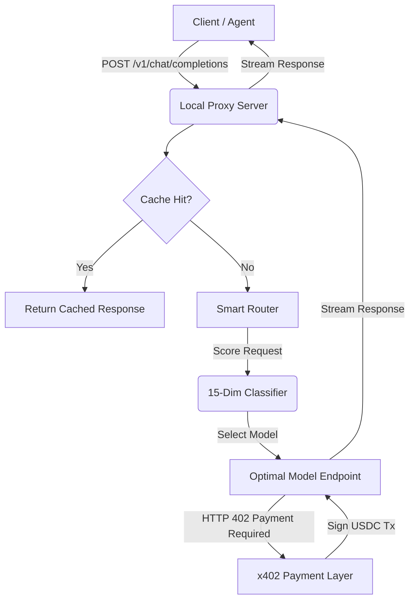

# Architecture of ALOE

## Overview
ALOE (Adaptive LLM Orchestration Engine) is an agent-native LLM router designed to operate autonomously without traditional human-in-the-loop prerequisites like API keys, credit cards, or account signups. It acts as a local proxy that intelligently routes LLM requests to the optimal provider based on cost, capability, and performance constraints.

## Core Components

1. **Local Proxy Server (Port 8402)**
   - Intercepts OpenAI-compatible API calls from any client (e.g., Continue.dev, Cursor, or autonomous agents).
   - Handles request parsing, caching, and forwarding.

2. **Smart Routing Engine**
   - **15-Dimension Classifier**: Analyzes incoming prompts based on complexity, token count, reasoning requirements, vision capabilities, and more.
   - **Profiles**: Supports routing strategies such as `eco`, `auto`, `premium`, and `free`.
   - Selects from 70+ available models dynamically to minimize cost while meeting capability thresholds.

3. **x402 Payment & Authentication Layer**
   - **Zero-Key Auth**: Replaces traditional API keys with cryptographic wallet signatures.
   - **Micropayments (x402 Protocol)**: Uses USDC on Base (EVM) and Solana for per-request settlement.
   - **Local Wallet**: Derives a secure wallet locally using a BIP-39 mnemonic on first run.

4. **Integration Layer**
   - **Skills & Tools**: Natively provides AI agents with tools for web search, polymarket trading, image generation, and phone/voice calls.
   - Natively hooks into the OpenClaw plugin ecosystem as well as functioning as a standalone server.

## System Flow Diagram

## Security & Privacy
- **Local Execution**: All routing decisions and wallet derivations happen locally on the user's machine.
- **Non-Custodial**: Funds (USDC) remain in the user's derived wallet until explicitly spent on a per-request basis. No prepayment or centralized balance is required.
